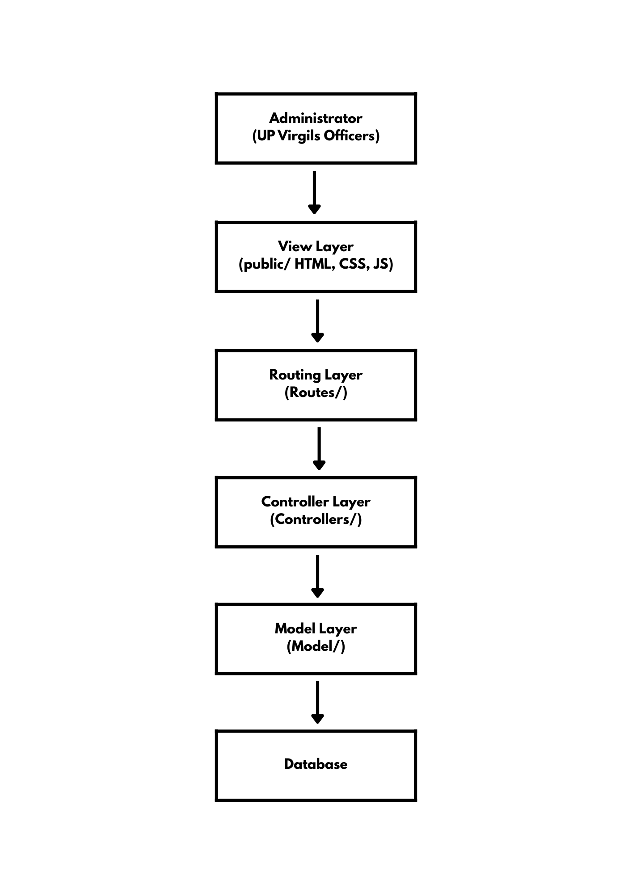

# upVIS(UP Virgils Integrated System)

<span>upVIS is a web-based information system designed to support the financial management and beneficiary support operations of UPV Virgils.</span>

---

## Logical View Diagram

upVIS (UPV Virgils Integrated System) is a web-based information system designed to automate the financial management and scholar support operations of UPV Virgils.
The primary user of the system is the Administrator, who manages donations, expenses, scholar records, member records, and distribution tracking.

The system centralizes:

- 📦 Distribution records

- 🧑 Members directory

- 🎓 Scholars directory

- ❤️ Donors directory

- 💰 Donation tracking

- 💸 Expense tracking

- 📊 Financial records and summaries

The goal of the system is to ensure transparency, proper tracking of distributions, and accurate financial reporting for the organization.

### Core Entities and Responsibilities

- **Member**  
  Represents the organization's officers or volunteers.  
  - Helps in distributions  

- **Scholar**  
  Represents the beneficiaries of the organization.  
  - Receives distributions  

- **Donor**  
  Represents individuals who donate funds.  
  - Can make multiple donations  

- **Donation**  
  Represents financial donations made by donors.  
  - Linked to a donor  
  - Contributes to financial records  

- **Expense**  
  Represents the operational costs of the organization.  
  - Deducted from the total donations  

- **Distribution**  
  Represents the distribution of groceries or monetary assistance.  
  - Involves the scholar  
  - Contains details about the distribution  

- **FinancialRecord**  
  Represents the financial summary of the organization.  
  - Total Donations  
  - Total Expenses  
  - Remaining Balance  

### Interaction Flow

The interaction flow is as follows:
   1. The Administrator interacts with the View Layer through HTML pages in the public/ folder.
   2. Client-side JavaScript sends HTTP requests to the backend.
   3. Requests are handled by the Routing Layer (Routes/).
   4. Routes forward requests to the appropriate Controllers.
   5. Controllers process business logic and interact with Models.
   6. Models communicate with the database to store or retrieve data.

<p align="center">
  
</p>

---

## Software Architecture

### 1. Client–Server Architecture
   
upVIS follows a Client–Server architecture.

      a. The Client is the web browser used by UPV Virgils administrators.
      
      b. The Server is the Node.js + Express backend application.
      
      c. Communication happens via HTTP requests and responses.
      
This architecture enables centralized data processing while allowing administrators to access the system through standard web browsers.

### 2️. Model–View–Controller (MVC)

The backend follows the MVC architectural pattern:

#### Model (Model/)
Represents the system’s data and database interaction logic.

Examples:

      a. Donations.js
      
      b. Expenses.js
      
      c. Scholars.js
      
      d. Members.js
      
These files define the structure of financial records, scholar data, and member data.

##### View (public/)
Contains:

      a. HTML pages (e.g., finance.html, scholars.html)
      
      b. CSS styling
      
      c. Client-side JavaScript
      
This layer handles presentation and user interaction.

#### Controller (Controllers/)
Contains business logic for processing requests.

Examples:

      a. financeController.js
      
      b. scholarController.js
      
      c. memberController.js
      
Controllers validate input, compute financial summaries, and coordinate database operations.

### 3️. Layered Architecture
The system is also structured as a layered architecture:

      a. Presentation Layer → public/
      
      b. Routing Layer → Routes/
      
      c. Application Logic Layer → Controllers/
      
      d. Data Access Layer → Model/
      
      e. Testing Layer → tests/

      f. Data Layer → MongoDB Atlas
      
Each layer has a defined responsibility that improves maintainability, scalability, and clarity of responsibilities.

---

## Project Stucture 
<span>Overview</span>

<span>The project is divided into two main components: Frontend and Backend. The backend follows an MVC structure to ensure separation of concerns, while the frontend handles user interface logic.</span>

##
### Backend Structure
<span>Description</span>

<span>The backend serves as the core of the system. It handles API requests, processes logic, and manages communication with the database. The backend is structured following the MVC architectural pattern to separate concerns between data handling, request processing, and routing.</span>

```bash
backend/  
├── Controllers/                    # Contains business logic and request handlers  
│   ├── distributionController.js   # Handles scholar distribution operations  
│   ├── donationController.js       # Handles donation recording and processing  
│   ├── donorController.js          # Manages donor-related logic  
│   ├── expenseController.js        # Handles expense tracking and validation  
│   ├── financeController.js        # Computes totals and financial summaries  
│   ├── memberController.js         # Manages organization member records  
│   ├── reportController.js         # Generates financial and summary reports  
│   └── scholarController.js        # Manages scholar records and status  
│
├── Model/                          # Defines database schemas and data operations  
│   ├── Distributions.js            # Distribution data model  
│   ├── Donations.js                # Donation data model  
│   ├── Donors.js                   # Donor data model  
│   ├── Expenses.js                 # Expense data model  
│   ├── Members.js                  # Organization member data model  
│   ├── Reports.js                  # Reporting data model  
│   └── Scholars.js                 # Scholar data model  
│
├── Routes/                         # Defines API endpoints and maps them to controllers  
│   ├── distributionRoutes.js       # Routes for distribution-related requests  
│   ├── donationRoutes.js           # Routes for donation operations  
│   ├── donorRoutes.js              # Routes for donor operations  
│   ├── expenseRoutes.js            # Routes for expense operations  
│   ├── financeRoutes.js            # Routes for finance summaries  
│   ├── memberRoutes.js             # Routes for member management  
│   ├── reportRoutes.js             # Routes for reporting  
│   └── scholarRoutes.js            # Routes for scholar management  
│
│
├── tests/                          # API endpoint testing files  
│   ├── distribution.http             
│   ├── donors.http                 
│   ├── members.http                
│   └── scholars.http               
│
└── server.js           # Main entry point of the Express application
```
##
### Frontend Structure
<span>Description</span>

 <span>The frontend serves as the client-side application that interacts with users. It is responsible for rendering UI components, handling user input, and communicating with the backend through REST API calls.</span>

```bash

frontend/
├── public/                                 # Static files
│   └── index.html                          # Single HTML file used by React
├── src/
│   ├── components/
│   │   ├── Navbar.jsx                      # Navigation bar
│   │   ├── Table.jsx                       # Reusable table component
│   │   └── Form.jsx                        # Reusable form component
│   │
│   ├── pages/                              # Page-level components
│   │   ├── Members.jsx                     # Members page
│   │   ├── Scholars.jsx                    # Scholars page
│   │   ├── Finance.jsx                     # Finance page
│   │   ├── Transactions.jsx                # Transactions page
│   │   └── Reports.jsx                     # Reports page
│   │
│   ├── services/                           # API connection logic
│   │   └── api.js                          # axios config
│   │
│   ├── App.jsx                             # React entry point
│   └── main.jsx                            # React entry point
│
└── package.json                            # Frontend dependencies
```

The system is structured into two primary components: Backend and Frontend, ensuring clear separation of responsibilities and maintainability.

The Backend follows the MVC (Model–View–Controller) architecture. Controllers manage business logic and request handling, Models define database schemas and perform CRUD operations, and Routes map API endpoints to their respective controllers. Additional testing files validate API functionality, while server.js initializes the Express server and middleware. This structure promotes modularity, scalability, and organized code management.

The Frontend is built using React and serves as the client-side interface. It consists of reusable components, page-level views, and centralized API service logic for backend communication. The application entry points (App.jsx and main.jsx) manage routing and rendering. This layered approach ensures a responsive, maintainable, and well-organized user interface.

Overall, the project structure supports clean architecture principles, efficient development, and long-term scalability of the full-stack application.
